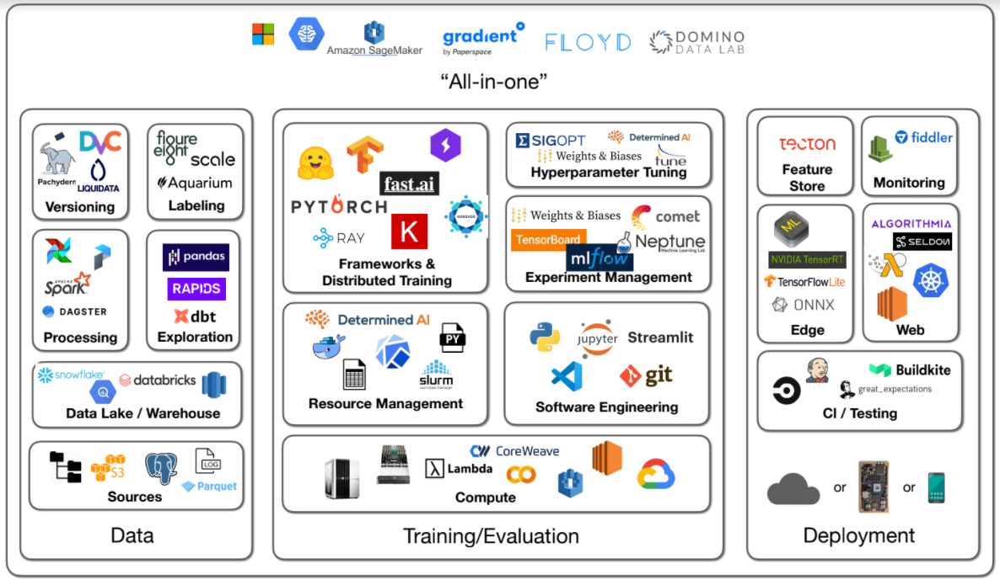

# Infrastructure & Tooling for Julialang ecosystem

## The big picture

> Taken from **Full Stack Deep Learning Spring 2021**

The figure mainly shows the infrastructure and tools used in the Python ecosystem, I will follow the same concept to collect the infrastructure and tools in the julia ecosystem.

## Data
### Sources
####  Filesystem
- locally mounted disk
- networked (e.g. NFS)

#### Database
- PostgresQL
- SQLite
- InfluxDB: for time series
- QuestDB: for time series

### Versioning
- DVC

For more information on data version control in Julia, please refer to this discussion [thread](https://discourse.julialang.org/t/data-storage-loading-for-data-produced-by-algorithms-and-metadata/27029)

### Exploration
- DataFrames.jl

## Training/Evaluation
### Computing
- desktop
- workstation

### Resource Management
- Docker

### Software Engineering
- Julia v1.6.5, LTS release
- VSCode
- Jupyter Notebook
- Pluto Notebook
- git

### Frameworks & Distributed Training
- [Flux.jl](https://github.com/FluxML/Flux.jl) ecosystem
- [MLJ.jl](https://github.com/alan-turing-institute/MLJ.jl)

### Experiment Management
- [Reproduce.jl](https://github.com/mkschleg/Reproduce.jl)
- [TensorBoardLogger.jl](https://github.com/JuliaLogging/TensorBoardLogger.jl)

### Hyperparameter Tuning
- [Hyperopt.jl](https://github.com/baggepinnen/Hyperopt.jl)
- [NaiveGAflux.jl](https://github.com/DrChainsaw/NaiveGAflux.jl)

See [use case](https://medium.com/analytics-vidhya/parallel-hyperparameter-tuning-in-julia-2eb17e756043) for using Hyperopt.jl

## Deployment
### CI/Testing
- GitHub Action

### Edge
- ONNX.jl

## Appendix
### Julia Package
#### Useful Utility
- `Revise`
- `Test`
- `ReTest`
- `PkgTemplates`
- `BenchmarkTools`
- `Chain`: piping
- `LoggingExtras`: Composable Loggers for the Julia Logging StdLib
- `Memento`: A flexible logging library for Julia
- `JuliaFormatter`
- `DotEnv` or `ConfigEnv`: loads environment variables from a .env file into ENV
- `WandbMacros` or `WeightsAndBiasLogger` or `Wandb`: logging to weights and biases (Wandb) dashboard.

#### Database
- `LibPQ`: LibPQ.jl is a Julia wrapper for the PostgreSQL libpq C library.

#### ML
- `Flux`: framework
- `GeometricFlux`: Geometric Deep Learning for Flux
- `GraphNeuralNetworks`
- `FluxArchitectures`: Complex neural network examples for Flux.jl. 
- `Transformer`: Julia Implementation of Transformer models
- `Metalhead`: Computer vision models for Flux
- `MLJ`: ML framework

#### ML Preprocessing
- `Augmentor`: A fast image augmentation library in Julia for machine learning.
- MLDataUtils.jl
- MLUtils.jl

#### Multi-threading/Multi-processing/Distributed
- `Dagger`: A framework for out-of-core and parallel execution
- `Polyester`

#### Math/Statistic
- `GeoStats`: An extensible framework for high-performance geostatistics in Julia.
- `QuadGK`
- `Random`
- `Distributions`
- `LinearAlgebra`
- `StatsBase`
- `Statistics`
- `DSP`

#### Data table and manipulation
- `DataFrames`: In-memory tabular data in Julia
- `Tables`: An interface for tables in Julia
- `FeatureTransforms`: Transformations for performing feature engineering in machine learning applications
- `TableTransforms`: Transforms and pipelines with tabular data
- `Impute`: Imputation methods for missing data in julia
- `DataConvenience`: Convenience functions missing in Julia
- `Cleaner`: A toolbox of simple solutions for common data cleaning problems.

#### Data IO
- `Arrow`
- `Parquet`
- `CSV`
- `JSON3`
- `BSON`

#### Notebook
- `IJulia`
- Pluto

#### Visualization
- `Plots`
    - Backends
        - `GR`
        - `PlotlyJS`, `PlotlyBase`
        - `PyPlot`
    - Extensions
        - `StatsPlots`
        - `GraphRecipes`
- `Makie`
    - Backends
        - `CairoMakie`
        - `GLMakie`(need GPU)
        - `WGLMakie`
    - Extensions
        - `AlgebraOfGraphics`
        - `GraphMakie`
        - `GeoMakie`
- `VegaLite`
- `Gadfly`
- `Compose`
- `Colors`
- `ColorSchemes`

#### Text processing
- `LaTeXStrings`

#### Build in packages (standard library)
- `LinearAlgebra`
- `Statistics`
- `Markdown`
- `Printf`
